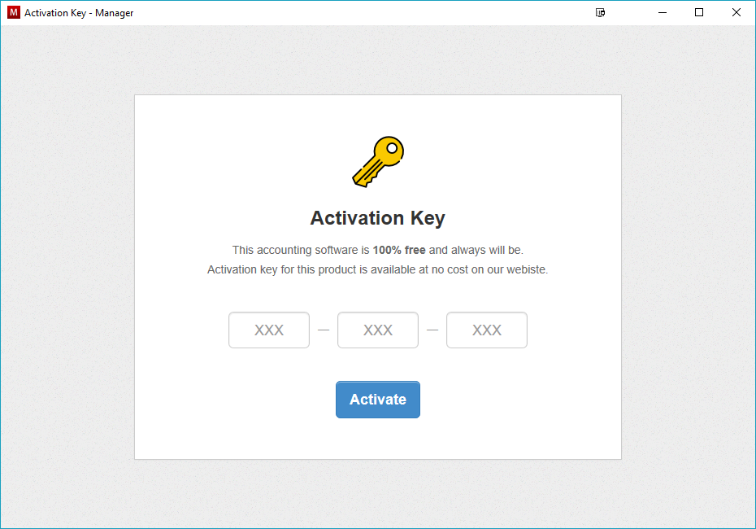
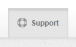
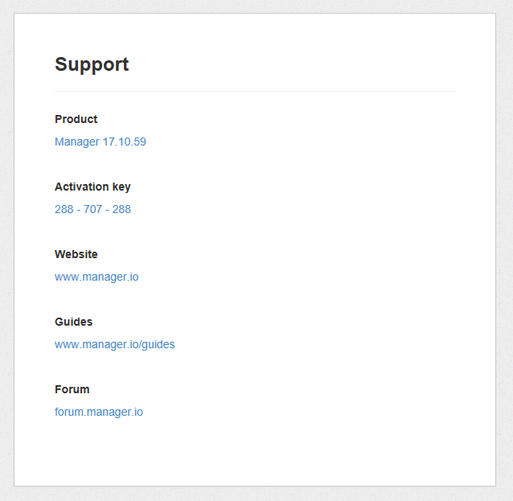
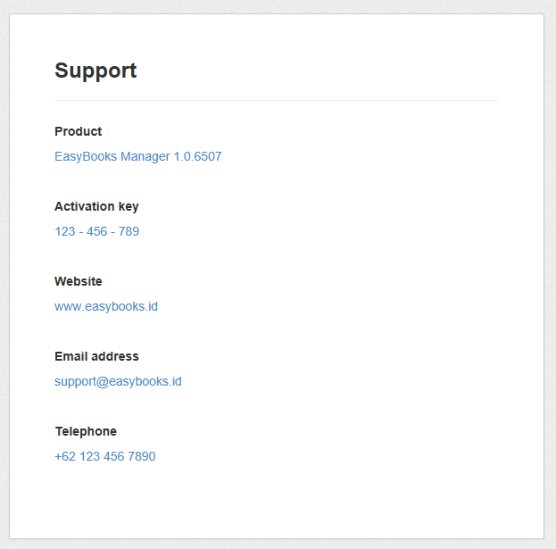

When Manager is installed for the first time, it is required to enter an activation key.

Manager will not work without an activation key. Activation key is 9 digit number which help identify where the software has been downloaded from.

For example, if you download Manager from this website, you will be given activation key `288-707-288`. When this activation key is entered, have a look under `Support` tab.

You will see contact details referring back to this website.

You can offer Manager for free on your website with your custom activation key. This means when your website visitors download Manager from your website, they can see your contact details under `Support` tab without any links to our website.

This is useful if you wish to boost visibility of your brand and to increase loyality of your existing clients. Every time a client uses Manager, they will see your name attached to it, they will associate it with convenience and quality and their loyalty to your brand will increase. You can also promote your website by offering free accounting software to new visitors without being obnoxious, increasing the public's awareness of your brand.

While desktop edition must remain free and you cannot charge for it, you can offer paid support, setup and training services. On top of that, you can earn generous recurring commission when your free users upgrade to cloud edition or server edition.

To issue custom activation code for your business, please email us to <u>contact@manager.io</u> with following details:

- Your Full Name
- Your Website URL (this is where people will be able to download Manager from. It could be your existing website or new one specifically created for promoting Manager)
- Email Address (optional if you wish to show it under "Support" tab)
- Telephone Number (optional if you wish to show it under "Support" tab)