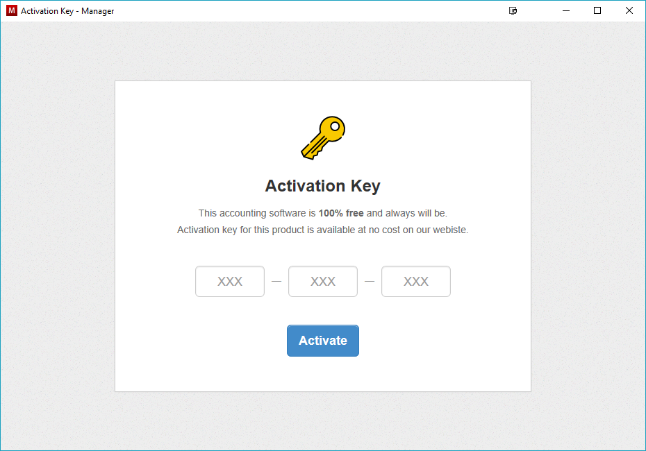
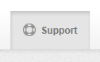
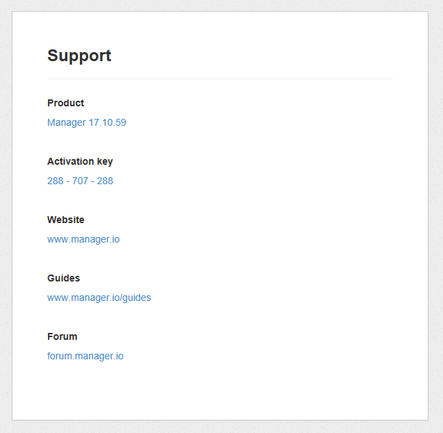
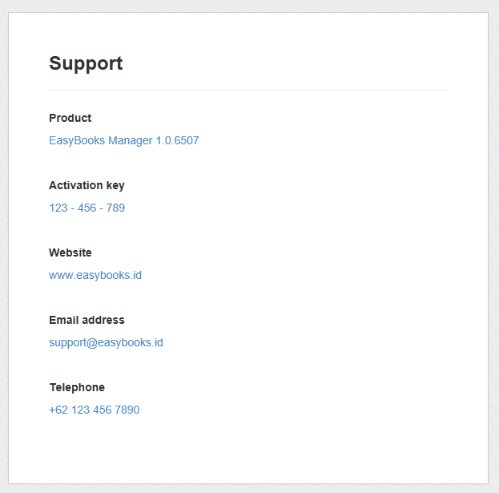

When Manager is installed for the first time, you are required to enter an activation key.

Manager will not function without an activation key. The activation key is a 9 digit number which helps to identify where the software was downloaded from.

For example, if you download Manager from this website, you will be given activation key `288-707-288`. When this activation key is entered, have a look under the `Support` tab.

You will see contact details referring back to this website.

You can offer Manager for free on your website with your custom activation key. As a result website visitors downloading Manager from your website will be able to see your contact details under the `Support` tab instead of ours.

This is useful if you wish to boost visibility of your brand or to increase loyality from your existing clients. Every time your client uses Manager, they will see your name attached to it. They will associate it with convenience and quality and their loyalty to your brand will increase. You can also promote your website by offering free accounting software to new visitors without being obnoxious, increasing the public's awareness of your brand.

While the desktop edition must remain free and you cannot charge for it, you can offer paid support, setup and training services. On top of that, you can earn generous recurring commission when your free users upgrade to the cloud edition or server edition.

To request a custom activation code for your business, please email us to <u>contact@manager.io</u> with following details:

- Your Full Name
- Your Website URL
- Email Address (optional)
- Telephone Number (optional)